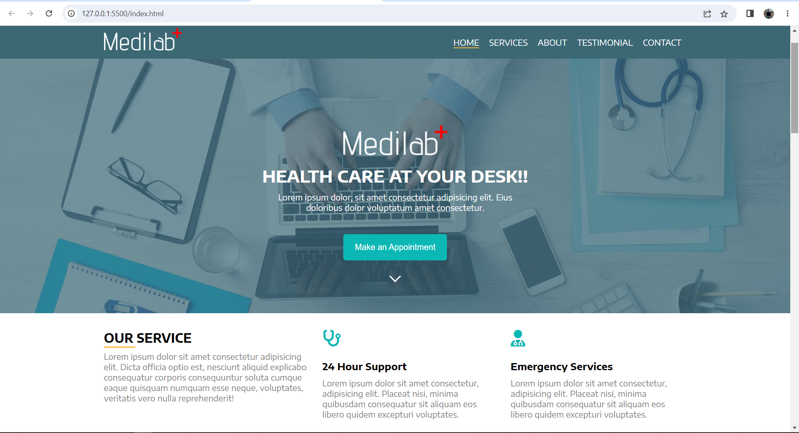

# Hospital-home-page

## Overview

### Screenshot

### Links

- Live Site URL: https://mohammad-shaar.github.io/Hospital-web-page/

## My process

### Built with

- Semantic HTML5 markup
- CSS custom properties
- Flexbox

### What I learned

- In this project I learnd how to buid a complete webpage.
- I lernd how to use Flexbox to build the project and make it responsive.
- And I learned how to use Font awesome to add an icon to the project.
